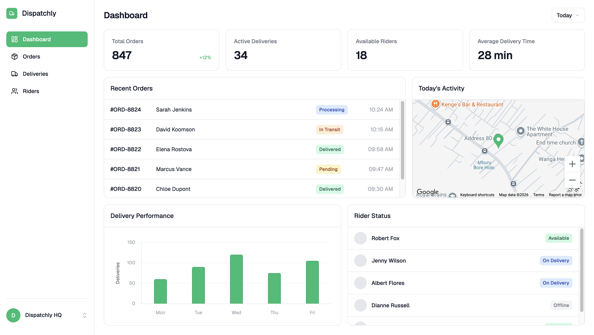
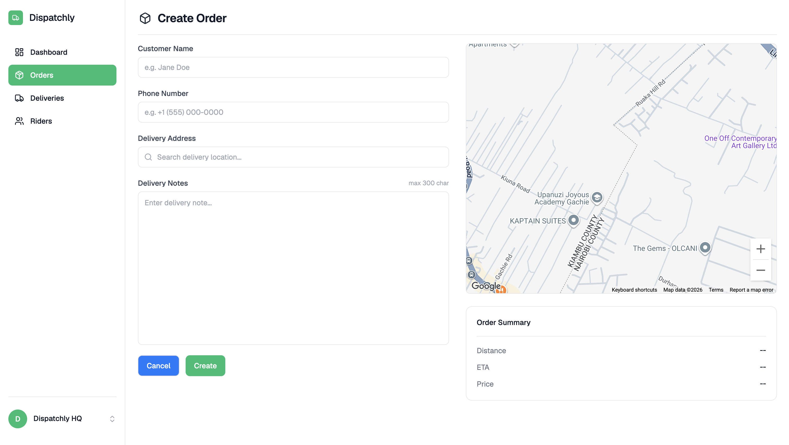
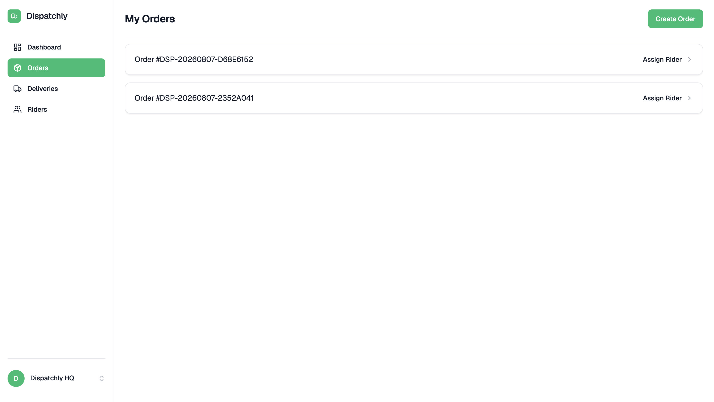
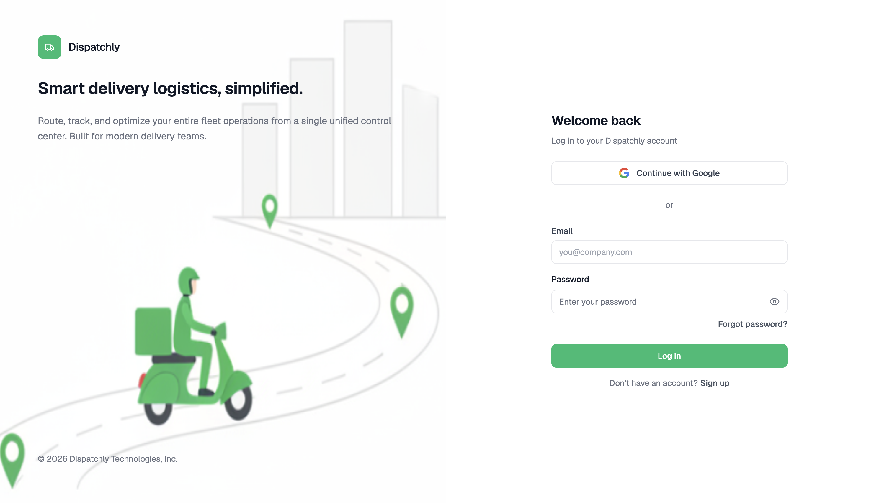
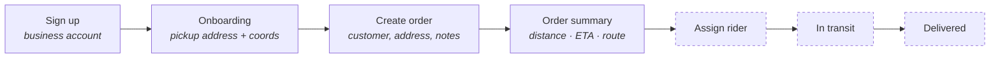
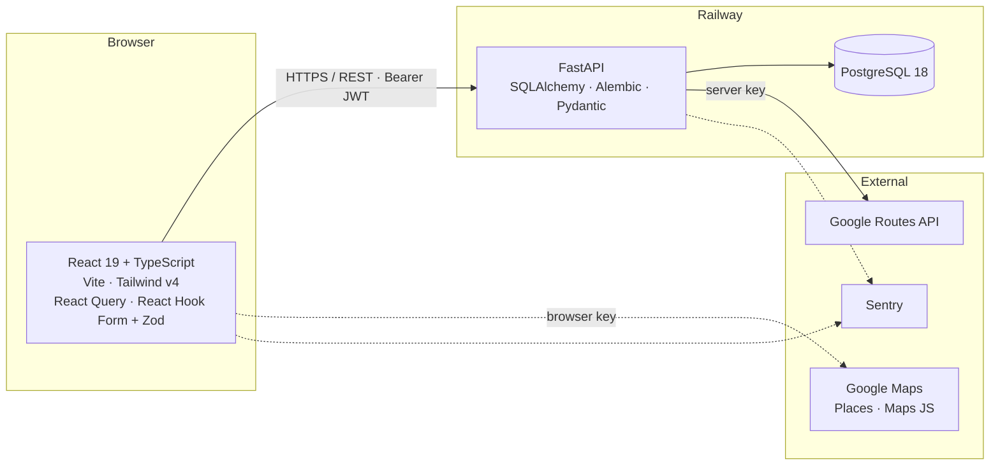
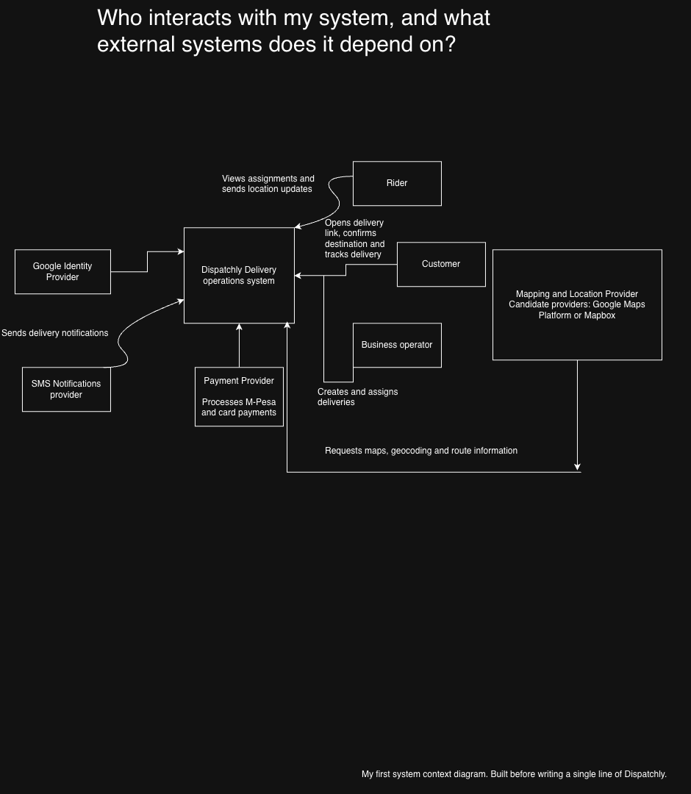
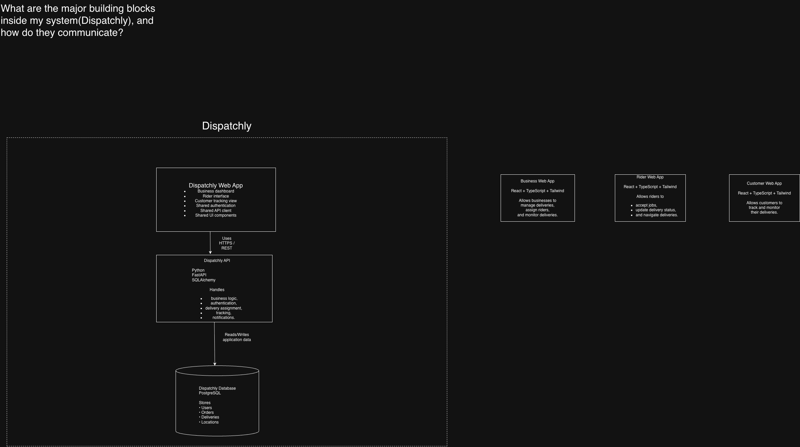
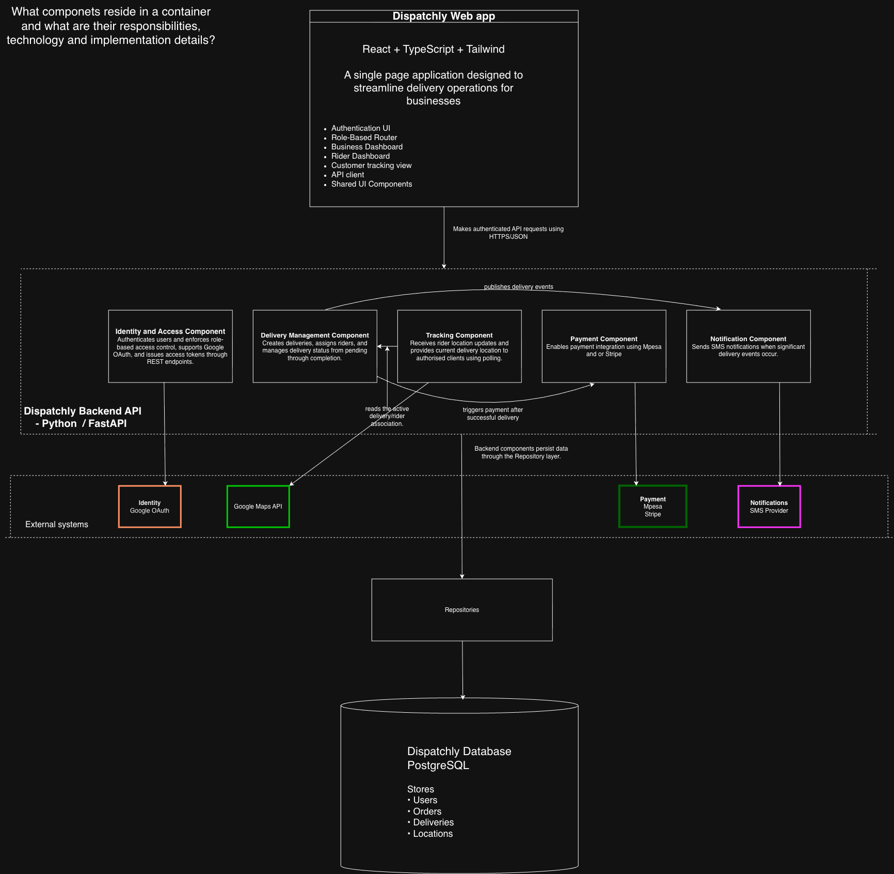
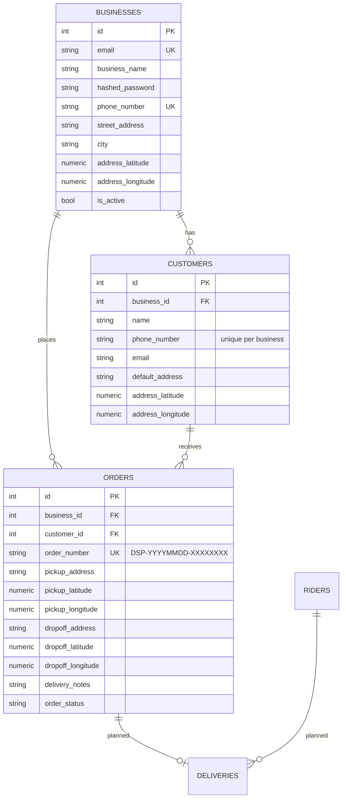

# 🚚 Dispatchly

**Route, track and manage deliveries from one control center.**

**[Live demo →](https://dispatchly.netlify.app/)**

Dispatchly is a delivery management platform for businesses that dispatch their own
motorcycle riders. A business signs up, sets its pickup address once, and from then on
every order is created against a real map: the customer's address is resolved through
Places autocomplete, the route is priced on the backend, and the order carries a distance
and an ETA before anyone is dispatched.

This repository is the **showcase** — screenshots, architecture, and the reasoning behind
the build. The application itself lives in two private repositories:

| | Repository | Stack | Deploy |
| --- | --- | --- | --- |
| Frontend | [`dispatchly-frontend`](https://github.com/mutindarisper/dispatchly-frontend) | React 19 · TypeScript · Vite · Tailwind v4 | [Netlify](https://dispatchly.netlify.app/) |
| Backend | [`dispatchly-backend`](https://github.com/mutindarisper/dispatchly-backend) | Python 3.14 · FastAPI · SQLAlchemy · PostgreSQL | [Railway](https://dispatchly-backend-production.up.railway.app/docs) |

> Both repositories are private. See [Source code](#-source-code) below.

---

## 📸 Product

### Dashboard

Operations at a glance — order volume, active deliveries, rider availability, and a live
map of today's activity.

### Create Order

The address field is a Google Places autocomplete; selecting a suggestion drops a pin and
fires a single call to the backend, which returns the distance, the ETA, and the encoded
route polyline for the map.

### Orders

### Assign Rider

Full order detail — customer, phone, delivery address, delivery note — beside the drop-off
location on the map.

### Sign in

---

## 🗺️ Delivery workflow

Solid steps are built end to end. Dashed steps have their UI and data model designed;
the rider and delivery services are the next slice of backend work.

---

## 🧱 Tech stack

**Frontend** — React 19, TypeScript, Vite 8, Tailwind CSS v4, React Router 7,
TanStack Query, React Hook Form + Zod, `@vis.gl/react-google-maps`, Chart.js, Axios,
Sentry, Vitest + Testing Library, Playwright.

**Backend** — Python 3.14, FastAPI, SQLAlchemy 2 (typed `Mapped` models), Alembic,
PostgreSQL via `psycopg` 3, Pydantic Settings, PyJWT, `pwdlib[argon2]`, httpx,
Sentry, pytest, mypy, ruff, `uv` for dependency management.

**Infrastructure** — Docker, Railway (API + Postgres), Netlify (SPA), GitHub Actions.

---

## 🏗️ Architecture

Documented as [C4 model](https://c4model.com/) diagrams — context, then containers, then
components. Source files are in [`assets/architecture/`](./assets/architecture) as
editable `.drawio`.

### System context

Who uses Dispatchly and what it depends on.

### Containers

The deployable pieces and how they talk.

### Components

Inside the API — routes, services, and data access.

### Frontend layering (MVVM)

The React app is organised by role rather than by feature, which keeps data access out of
the components entirely:

| Layer | Responsibility |
| --- | --- |
| `models/` | Domain types and Zod schemas. No React, no fetching. |
| `services/` | The Axios client and API functions. No React imports. |
| `viewmodels/` | `useXViewModel` hooks — own state, wrap React Query, validate with schemas. |
| `views/` | Page components. Consume one viewmodel, compose components. |
| `components/` | Presentational only. No fetching, no business logic. |
| `providers/` | App-wide context — auth, query client, Google Maps loader. |
| `router/` | Route table plus the route guards. |

A view never imports a service or calls React Query directly; it goes through a viewmodel.

---

## 🗄️ Data model

`businesses`, `customers`, and `orders` are live, created through Alembic migrations.
`riders`, `deliveries`, and `tracking_locations` are designed in
[`Dispatchly_ERD_final.drawio`](./assets/architecture/Dispatchly_ERD_final.drawio) and not
yet migrated.

Notes on the shape:

- **Coordinates are `Numeric`, not `Float`.** Latitude/longitude are stored at fixed
  precision and converted via `Decimal(str(value))`, so the stored value is the decimal
  the client actually sent rather than the nearest binary float to it.
- **`(business_id, phone_number)` is unique on customers**, not `phone_number` alone. Two
  businesses can serve the same person; within one business, a repeat phone number reuses
  the existing customer record instead of creating a duplicate.
- **Every order carries its own pickup snapshot.** Copying the business address onto the
  order at creation means a business relocating later doesn't rewrite the history of
  where past deliveries actually started.

---

## 🔌 API surface

All order routes are scoped to the authenticated business — a JWT identifies the tenant,
and every query filters on it.

| Method | Path | Purpose |
| --- | --- | --- |
| `POST` | `/auth/register` | Create a business account |
| `POST` | `/auth/login` | OAuth2 password flow → bearer token |
| `GET` | `/auth/me` | Current business profile |
| `PATCH` | `/auth/update_profile` | Onboarding: pickup address, phone, coordinates |
| `POST` | `/orders` | Create an order (upserts the customer) |
| `GET` | `/orders` | List orders — paginated, newest first |
| `GET` | `/orders/summary` | Distance, ETA, and route polyline for a destination |
| `GET` | `/orders/{order_number}` | Single order with its customer |

Interactive docs are served by FastAPI at
[`/docs`](https://dispatchly-backend-production.up.railway.app/docs).

---

## 🧠 Engineering decisions

### Routing runs on the server, never in the browser

The Google Routes API key is a **server** key held only by the backend. The obvious
alternative — calling Routes from React — was rejected: it ships a billable key to every
visitor, and it lets the client name its own origin, so a caller could price any delivery
as a short hop. The origin is always read from the authenticated business's stored
address.

The two Google keys are deliberately different in kind: the browser holds a
referrer-restricted key for Places and the Maps JS SDK; the server holds an IP-restricted
key for Routes. A referrer-restricted key fails server-side with
`API_KEY_HTTP_REFERRER_BLOCKED`, because server calls send no `Referer`.

### The Routes field mask is derived, not written twice

Google bills by the fields you request and returns only what the mask names. The mask is
generated from the same tuples the response parser reads, so a field can't be paid for
without being used, or read without being requested (which would surface as a `KeyError`
mid-request).

The encoded polyline is passed through to the browser untouched — the Maps SDK decodes it
natively, and expanding it server-side would ship a far larger point list.

Travel mode is `TWO_WHEELER`, not `BICYCLE`: Dispatchly delivers by motorcycle, and the
bicycle profile routes down paths a motorcycle can't use.

### ETAs round up, and only at the edge

`RouteSummary` keeps whole seconds; how an ETA is displayed is the caller's decision, and
rounding early throws away the precision needed to make it. At the route layer a
fractional `60.5s` rounds up; at the API layer the ETA rounds up to the next minute. A
business quoting a customer would rather be a minute pessimistic than a minute late.

### Failure modes are separated by what they mean

| Condition | Response | Alerting |
| --- | --- | --- |
| Provider unreachable, bad key, HTTP error | `503` — "try again" | Reported to Sentry by hand |
| No route exists between the points | `422` — "no route found" | Silent |
| Business has no pickup address | `400` — "complete your address" | Silent |

The provider error is captured explicitly because converting it to an `HTTPException`
means Sentry's own hook never sees it — an expired key would otherwise degrade every
order summary in silence. "No route found" is expected, not a fault: nothing to alert on,
and a retry would fail identically.

### Authentication

Email and password over the OAuth2 password flow, with Argon2 hashing via `pwdlib` and
HS256 JWTs carrying the business id. The token lives in `localStorage`; an Axios request
interceptor attaches it, and a `401` on an authenticated request clears it and bounces to
`/login` with the intended path remembered. Google OAuth is planned, not built.

### Secrets never reach a traceback

Every credential in `Settings` is a `SecretStr`, so Pydantic renders it as `**********` in
reprs — a traceback carrying the settings object into logs, or into Sentry (which captures
frame locals), no longer carries the values too. `GOOGLE_MAPS_API_KEY` is required with no
default on purpose: a missing key should stop the process at boot rather than fail one
order summary at a time, each an outbound call with a blank key and a fresh alert.

The Routes key is sent as a header rather than a query parameter, because URLs are logged
by proxies and error reporters long after the request is gone.

### Observability with PII off

Sentry is initialised in both apps **before** the framework is constructed — the SDK
patches Starlette and SQLAlchemy on init, so anything built earlier goes uninstrumented.
`send_default_pii=False`: the service handles auth tokens and customer records, and the
default would ship request headers, cookies, and client IPs.

On the frontend, Sentry wraps `createBrowserRouter` so navigations are reported under
parameterised paths (`/orders/:orderNumber/assign-rider`) rather than as thousands of
distinct URLs. Source maps are uploaded at build time with a token that is deliberately
**not** `VITE_`-prefixed, so it can never reach the bundle.

### State management, by scope

Server state is React Query's job — orders, order details, the business profile. Local
form state is React Hook Form with Zod resolvers. Context carries only what is genuinely
app-wide: the auth token, the query client, and the Maps loader. There is no global store,
because nothing needed one.

### The Maps script loads only behind auth

`MapsProvider` sits inside the protected route subtree, so the Google Maps script is
fetched only once someone is signed in. Keeping it off `/login` was a fix, not a
preference: a blocked or failing script load there produced unhandled errors on a page
with no map at all.

### Small database decisions that show up under load

Order queries use `selectinload(Order.customer)` — without it the nested customer is lazy
loaded, costing one extra query per row returned. Listing is ordered by
`created_at DESC, id DESC`, with the id breaking ties so pages stay stable when timestamps
collide. `/orders/summary` is declared *before* `/orders/{order_number}`, or the dynamic
route would match `"summary"` as an order number and the endpoint would be unreachable.

---

## 🧪 Testing

The order summary feature was built test-first — the commit history walks one behaviour at
a time from "request a route with both locations" through "handle transport failures" to
"return distance in kilometres". A design doc (`design_docs/order_summary.md`) written
before the code enumerated the testable behaviours, including the ones about failure: no distance
shown when the customer location is missing, an explicit unavailable state when Google
fails, and the key never reaching the browser.

| Layer | Tooling | What it covers |
| --- | --- | --- |
| Backend unit | pytest + fake HTTP transport | Routing client: field mask, travel mode, malformed payloads, timeouts, no-route responses |
| Backend integration | pytest against real PostgreSQL | Auth and order APIs, with Alembic migrations applied to build the schema |
| Frontend unit | Vitest + Testing Library | Components and API error mapping |
| Frontend E2E | Playwright (Chromium) | Smoke flow in a real browser |

The backend suite runs against a genuine Postgres rather than SQLite, because it applies
the real migrations — a broken migration chain fails the test run. It uses
`TEST_DATABASE_URL`, or falls back to `DATABASE_URL` with `_test` appended, so a
development database is never written to. Each test runs inside a transaction that is
rolled back afterwards, so tests don't leak rows into one another.

---

## 🔄 CI/CD

**Backend** — on every push and PR to `main`: ruff lint → ruff format check → mypy →
pytest against a PostgreSQL 18 service container, with the Docker image build gated on all
of them passing. Railway redeploys from `main`, running `alembic upgrade head` as a
pre-deploy step.

**Frontend** — ESLint → Vitest → Playwright (with the browser binaries cached on the
installed Playwright version) → production build, then artefact upload and a staging
deploy gated on the browser suite as well as the build, so a green bundle with a broken
user flow never reaches an environment. A separate matrix job builds on Node 20, 22, and
24. Netlify publishes `dist/` with a catch-all rewrite to `index.html`, since every deep
link in a `createBrowserRouter` SPA has to fall through or a refresh 404s.

Deployment notes worth keeping: the runtime Docker image contains only the built
virtualenv, so `uv` isn't available at runtime and Railway commands must call executables
directly; and the image avoids BuildKit-only `--mount=type=cache` syntax, which Railway's
builder rejects.

---

## 🚧 Roadmap

- [ ] Rider and delivery services — the schema is designed, the UI is built against it
- [ ] Live rider tracking (`tracking_locations`)
- [ ] Real dashboard metrics, replacing the design-time placeholder data
- [ ] Delivery pricing derived from distance — the summary card already reserves the row
- [ ] Google OAuth alongside email and password
- [ ] Order status transitions and customer notifications

---

## 🔒 Source code

Both repositories are private. Available for technical review on request —
[mutinda.dev@gmail.com](mailto:mutinda.dev@gmail.com).
