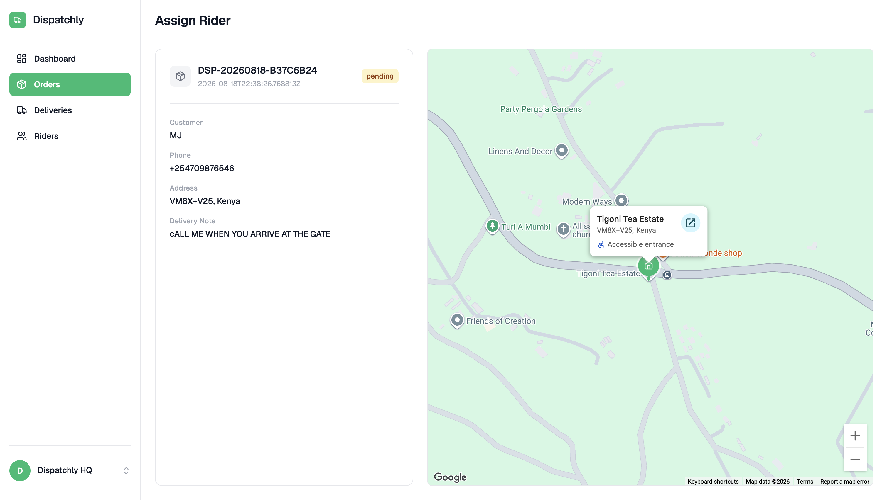
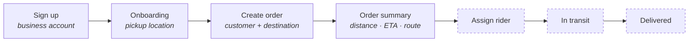
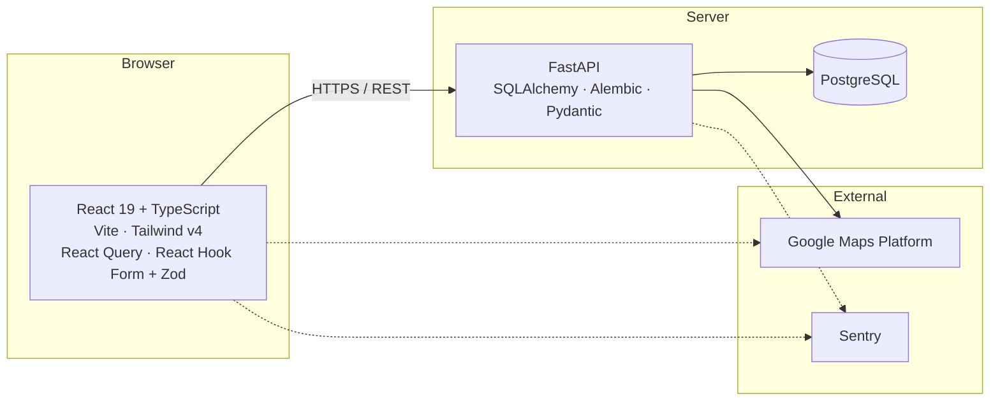
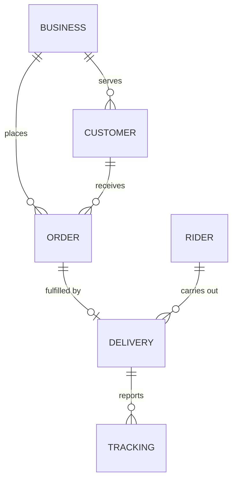

# 🚚 Dispatchly

**Route, track and manage deliveries from one control center.**

**[Live demo →](https://dispatchly.netlify.app/)**

Dispatchly is a delivery management platform for businesses that dispatch their own
motorcycle riders. A business signs up, sets its pickup address once, and from then on
every order is created against a real map: the customer's address is resolved through
Places autocomplete, and the order carries a distance and an ETA before anyone is
dispatched.

This repository is the **showcase** — screenshots, architecture, and the reasoning behind
the build. The application itself lives in two private repositories:

| | Repository | Stack | Deploy |
| --- | --- | --- | --- |
| Frontend | [`dispatchly-frontend`](https://github.com/mutindarisper/dispatchly-frontend) | React 19 · TypeScript · Vite · Tailwind v4 | Netlify |
| Backend | [`dispatchly-backend`](https://github.com/mutindarisper/dispatchly-backend) | Python 3.14 · FastAPI · SQLAlchemy · PostgreSQL | Railway |

> Both repositories are private. See [Source code](#-source-code) below.

---

## 📸 Product

### Sign in

### Dashboard

Operations at a glance — order volume, active deliveries, rider availability, and a live
map of today's activity.

### Create Order

The address field is a Google Places autocomplete; selecting a suggestion drops a pin, and
the order summary fills in with the distance and ETA for that delivery.

### Orders

### Assign Rider

Full order detail — customer, phone, delivery address, delivery note — beside the drop-off
location on the map.

---

## 🗺️ Delivery workflow

Solid steps are built end to end. Dashed steps have their UI and domain model designed;
the rider and delivery services are the next slice of work.

---

## 🧱 Tech stack

**Frontend** — React 19, TypeScript, Vite, Tailwind CSS v4, React Router, TanStack Query,
React Hook Form + Zod, Google Maps for React, Chart.js, Axios, Sentry, Vitest + Testing
Library, Playwright.

**Backend** — Python 3.14, FastAPI, SQLAlchemy 2 (typed models), Alembic, PostgreSQL,
Pydantic, JWT auth with Argon2 password hashing, Sentry, pytest, mypy, ruff.

**Infrastructure** — Docker, Railway (API + database), Netlify (SPA), GitHub Actions.

---

## 🏗️ Architecture

Documented as [C4 model](https://c4model.com/) diagrams — context, then containers, then
components.

### System context

Who uses Dispatchly and what it depends on.

### Containers

The deployable pieces and how they talk.

### Components

Inside the API — routes, services, and data access.

### Frontend layering

The React app follows a layer-based **MVVM** structure: domain types and schemas, an API
service layer, viewmodel hooks that own state and data fetching, and purely presentational
components composed by page-level views. A view never reaches for the network directly —
it consumes a viewmodel. The result is that business rules have exactly one place to live,
and components stay trivially testable.

---

## 🗄️ Domain model

The entities the platform is built around, and how they relate:

Businesses, customers, and orders are live. Riders, deliveries, and tracking are modelled
and scheduled, not yet shipped. Every business is a tenant: its data is isolated, and
nothing is readable across account boundaries.

---

## 🧠 Engineering decisions

**Multi-tenancy from day one.** Every authenticated request is scoped to the business that
made it. Tenant isolation is enforced at the data-access layer rather than left to
individual endpoints, so it can't be forgotten in a new feature.

**Third-party integrations stay server-side.** Anything involving a paid provider
credential or a value the business relies on runs on the backend, never in the browser.
Keeping it there means the credentials aren't shippable to a visitor and the inputs can't
be tampered with by the client.

**Authentication.** Email and password with token-based sessions and Argon2 hashing.
Expired or invalid credentials drop the user back to sign-in with their intended
destination remembered. Google OAuth is planned.

**State management, by scope.** Server state is React Query's job; form state is React
Hook Form with Zod schemas shared between validation and types; context carries only what
is genuinely app-wide. No global store, because nothing needed one.

**Types enforced, not suggested.** Strict TypeScript on the frontend and mypy on the
backend, both gating CI — a type error fails the build rather than the review.

**Observability with PII off.** Sentry on both sides, error and performance monitoring,
with personally identifiable data explicitly excluded: the platform handles customer
records, and none of that belongs in a monitoring tool.

**Failures are designed, not discovered.** Provider outages, unreachable destinations, and
incomplete business profiles each produce a distinct, actionable message in the UI rather
than a generic error — and only the ones worth waking someone for reach alerting.

---

## 🧪 Testing

Core features are built test-first: the behaviour is written down before the code, failure
modes included.

| Layer | Tooling |
| --- | --- |
| Backend unit | pytest, with third-party providers faked at the transport boundary |
| Backend integration | pytest against a real PostgreSQL instance |
| Frontend unit | Vitest + Testing Library |
| Frontend E2E | Playwright |

Integration tests run against a genuine PostgreSQL rather than an in-memory substitute,
with the real migrations applied — so a broken migration chain fails the test run, not the
deploy.

---

## 🔄 CI/CD

Both repositories run gated pipelines on GitHub Actions:

- **Backend** — lint → format check → type check → tests against a real database, with the
  container image build gated on all of them. Deploys run migrations before releasing.
- **Frontend** — lint → unit tests → end-to-end browser tests → production build, with
  deployment gated on the browser suite as well as the build, so a green bundle with a
  broken user flow never reaches an environment.

---

## 🚧 Roadmap

- [ ] Rider and delivery services — the domain model is designed, the UI is built for it
- [ ] Live rider tracking
- [ ] Real dashboard metrics, replacing the design-time placeholder data
- [ ] Delivery pricing derived from distance
- [ ] Google OAuth alongside email and password
- [ ] Order status transitions and customer notifications

---

## 🔒 Source code

Both repositories are private. Available for technical review on request —
[mutinda.dev@gmail.com](mailto:mutinda.dev@gmail.com).
